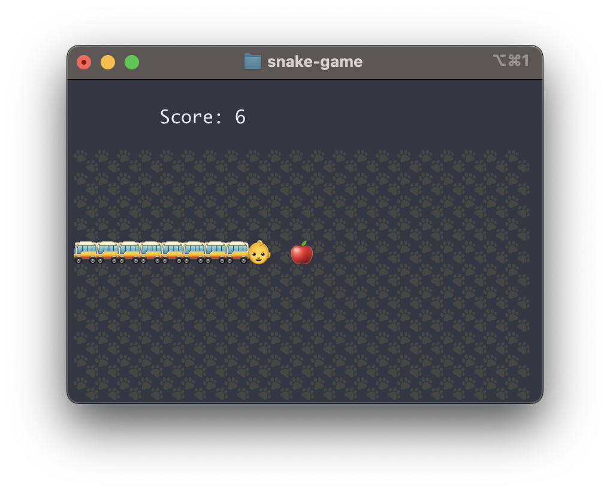

# Snake-Game

### How to play?

```bash
# 1. build the project
cargo build --release

# 2. run the project
cargo run --release
# or
./target/release/snake_game
```

The smaller the terminal window, the harder the game. The reason is that the step is calculated by the terminal size. ($T_{step} = row \times col - score$) 

Actually, when the window is very small, this game really hard.

You can manipulate the snake by the arrow keys, and you can close the game by pressing <kbd>ESC</kbd>. 

### Screenshot


